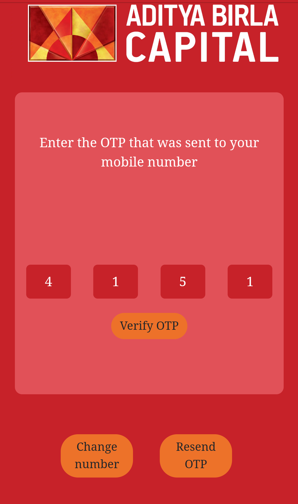

<h3 align="center">Chatbot for Unsecured Personal Loans</h3>
 
 

 

------------------------------------------

> The current procedure for registering for an Unsecured Personal Loan for Aditya Birla Capital is to fill out a form on their website which is very boring.

> So here comes Loan-er, a PWA chatbot which would make this process interactive for the user.

> Also the user shouldn't be bound by the language they use to chat with Loan-er so Loan-er can also talk in Hindi! 🤩

> One can add support for multiple languages by contributing towards improving Loan-er.

##### Web-App

<!--  -->
  

  

  

<!-- 

  

 -->

##### WhatsApp

  

##### Facebook Messenger

  

------------------------------------------

### Future Add-Ons

- [ ] Support for more languages.
- [ ] Use OCR to extract all details from user's PAN/Aadhar card.

------------------------------------------
### Contributing

 We're are open to `enhancements` & `bug-fixes` :smile: Also do have a look [here](./CONTRIBUTING.md)

------------------------------------------
### Contributors

- [@KaustubhDamania](https://github.com/KaustubhDamania)
- [@g-bhagwanani](https://github.com/g-bhagwanani)
- [@deepdama10](https://github.com/deepdama10)

------------------------------------------

### Recognition

 This repository / project was a part of Code Adventure 2019 which secured the 1st position.
